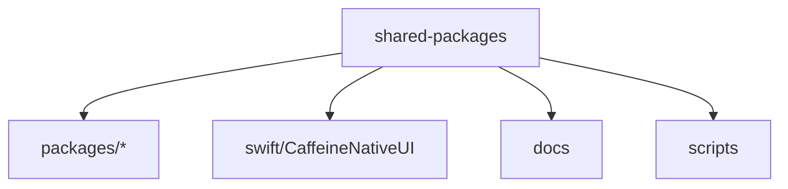
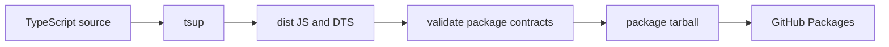
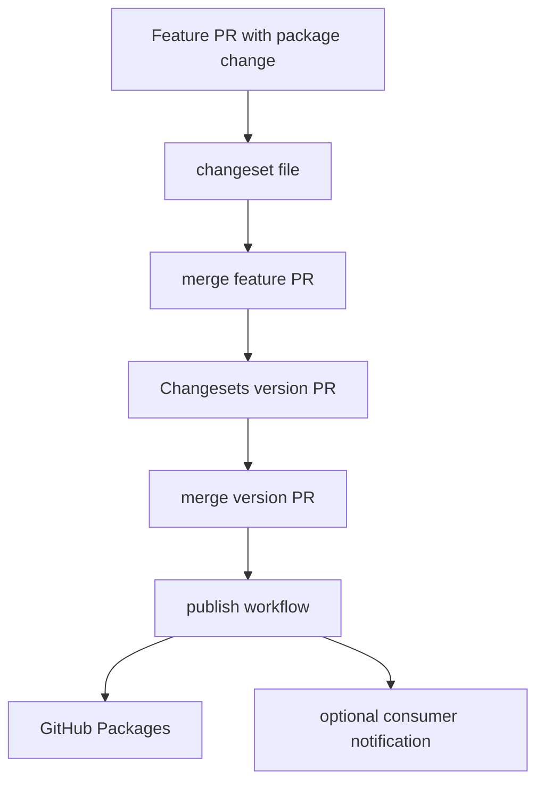
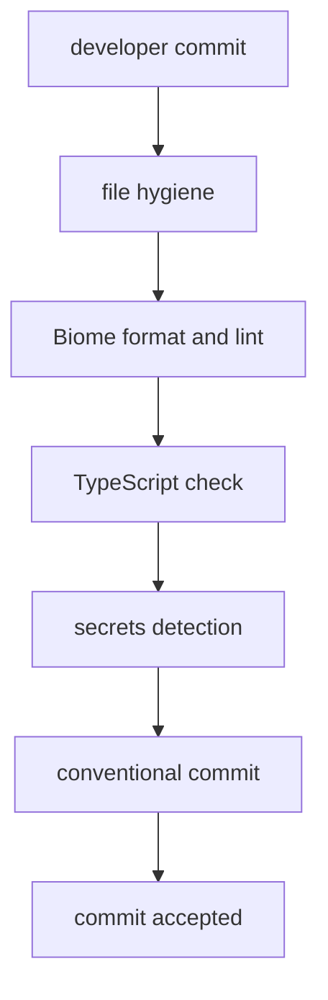
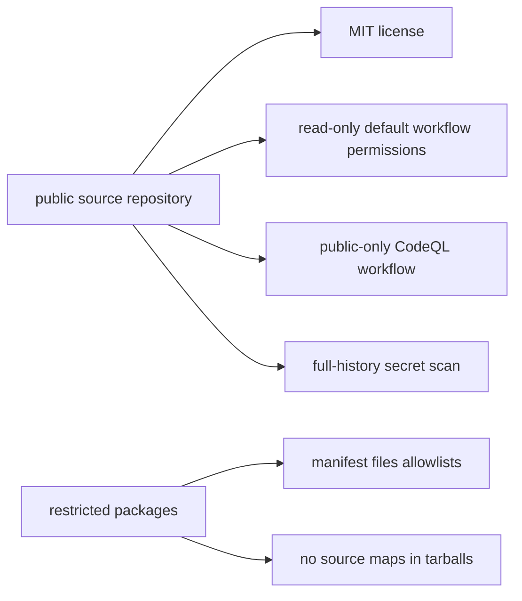

# Architecture And Release Flow

## Monorepo Layout

## Package Build Flow

Each package declares explicit `files` allowlists so publish output is limited
to built `dist` artifacts, package metadata, CSS where needed, and changelogs.
Source maps are disabled for public-readiness so package tarballs do not include
embedded source copies.

## Changeset Release Flow

Consumer notification is optional and should be configured without documenting
private consumer operational details in this repository.

## Local Hook Flow

If a hook auto-fixes files, the hook re-stages the generated changes and retries
within the configured limit.

## Public-Readiness Boundary

The repository can be MIT-licensed while packages remain restricted on GitHub
Packages. That posture should stay explicit in manifests, workflow permissions,
and public documentation.
