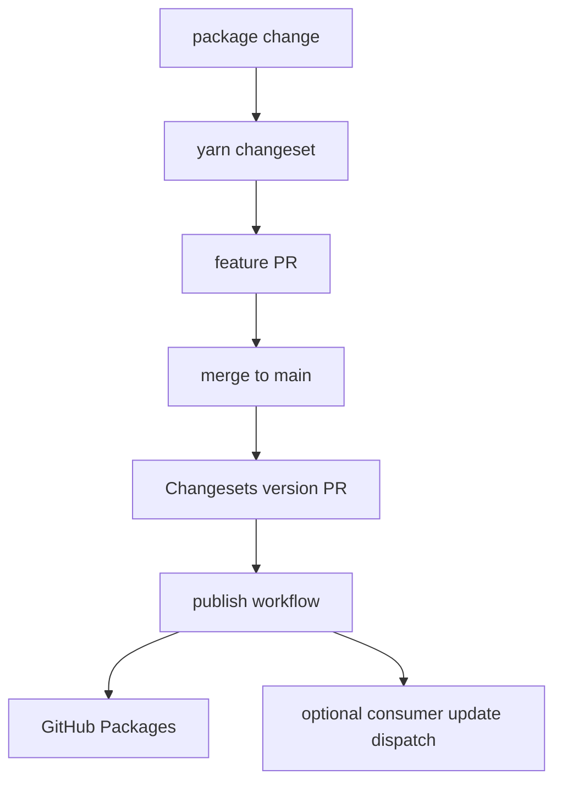

# Auto-Publish And Version Bumping

This document describes the release system for `@caffeinebounce/*` packages.

## Overview

The release flow has three parts:

1. Changesets record package version intent.
2. GitHub Actions validates, versions, and publishes packages.
3. Optional consumer automation can create update PRs in consuming
   repositories.

## Standard Workflow



## Making A Package Change

```bash
# make code changes
yarn test
yarn changeset
git add .
git commit -m "feat(ui): add component variant"
```

Changesets ask for:

- affected packages
- semver bump (`patch`, `minor`, or `major`)
- changelog summary

Docs-only, test-only, changelog-only, and repository tooling changes that do
not alter published package contents can skip a changeset. Include a clear PR
body marker such as:

```text
Changelog: skip - docs-only update.
```

## Version PR

After a package-changing PR merges, Changesets opens a version PR that:

- updates package versions
- updates package changelogs
- removes consumed `.changeset/*.md` files

Maintainers review and merge this PR to publish.

## Publish Workflow

The publish workflow runs the local proof set and then publishes to GitHub
Packages:

```bash
yarn lint
yarn typecheck
yarn test
yarn build
yarn test:consumer-smoke
yarn size:ui
yarn validate:packages
yarn release
```

Packages remain scoped to GitHub Packages unless a separate publishing decision
changes that posture.

## Manual Release Commands

Manual release commands are mostly for maintainers handling edge cases:

```bash
yarn changeset status
yarn version-packages
yarn release
```

## Consumer Updates

Consumer update automation is optional and should be documented in each
consumer repository. This repository should only document the generic contract:
published packages can trigger an `update-shared-packages` dispatch with a
payload containing the source SHA and the published package list.

Manual consumer update trigger:

```bash
gh workflow run update-shared-packages.yml --repo <owner>/<consumer-repo>
```

## Registry Auth

Use GitHub Packages auth for installs and publishing:

```ini
@caffeinebounce:registry=https://npm.pkg.github.com
//npm.pkg.github.com/:_authToken=${GITHUB_TOKEN}
```

Use read-only package tokens for installs. Publishing credentials should be
available only to release workflows.

## Troubleshooting

If no version PR appears, run:

```bash
yarn changeset status
```

If publishing fails, verify:

- package names and versions are correct
- `dist` exists after `yarn build`
- package manifests include the expected `files` allowlist
- registry auth is available to the publish workflow
- `yarn validate:packages` passes locally

If a consumer update PR is not created, inspect that consumer repository's
workflow runs and secrets. Keep consumer-specific logs and runbooks in the
consumer repository.
